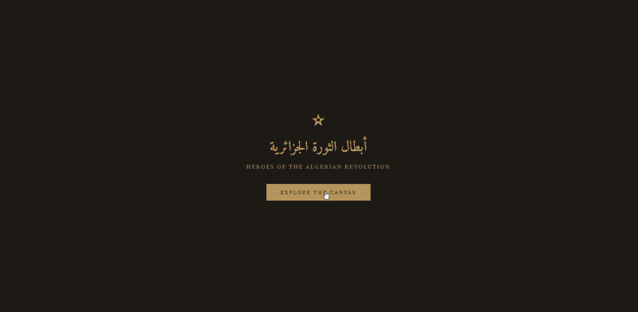

<div align="center">

# ★ أبطال الثورة الجزائرية ★
### Heroes of the Algerian Revolution


*An immersive infinite 3D canvas honoring the Mujahideen who fought for Algeria's independence (1954–1962)*

**[🌐 Live Demo](https://algerian-heroes.surge.sh)** · **[📂 Repository](https://github.com/wadjihcs/Algerian-mujahideen-historical-resource)**

---


</div>

---

## 🎯 About

This project is a **living digital memorial** dedicated to the heroes of the Algerian War of Independence (1954–1962). It presents an **infinite 3D canvas** where visitors can freely explore interactive cards, each telling the story of a revolutionary figure or pivotal event.

The **infinite, endlessly scaling canvas** is not just a technical choice — it is a deliberate symbol. The Mujahideen who sacrificed their lives for Algeria's freedom are **countless and unlimited**. This project only mentions the most commonly known among them, but the infinite scroll represents the **millions of unnamed heroes** whose stories may never be told. No matter how far you explore, there are always more cards — just as there are always more martyrs to remember.

The infinite canvas concept is inspired by [this Tympanus/Codrops tutorial](https://tympanus.net/Tutorials/InfiniteCanvas/), adapted with Three.js and reimagined to serve this historical purpose.

> *"ألقوا بالثورة إلى الشارع، سيحتضنها الشعب"*
> — Larbi Ben M'hidi



---

## ✨ Features

| Feature | Description |
|---|---|
| 🌌 **Infinite 3D Canvas** | Navigate a seamless, procedurally generated grid of historical cards |
| 🖼️ **19 Historical Cards** | Leaders, heroines, commanders, and key events with bilingual content |
| 📸 **Wikipedia Photos** | Auto-fetches portraits and historical images via the Wikipedia REST API |
| 🎵 **Background Music** | Ambient soundtrack with toggle control |
| 📱 **Mobile Optimized** | Touch gestures (pinch zoom, swipe), gesture tutorial, swipe-to-dismiss panels |
| 🧭 **Interactive Directory** | Browse all cards organized by category |
| ✈️ **Fly-to Animation** | Smooth camera transitions when selecting a card |
| 🌟 **Particle Effects** | Floating dust particles that follow the camera |
| 🔒 **Security Headers** | CSP, X-Frame-Options, anti-scraping protections |

---

## 🗂️ Project Structure

```
algerian-mujahideen-historical-resource/
├── index.html        # HTML structure + embedded CSS
├── app.js            # Entry point, animation loop, initialization
├── state.js          # Shared mutable state across all modules
├── data.js           # Historical data for all 19 cards
├── scene.js          # Three.js scene, camera, renderer, lighting, particles
├── chunks.js         # Infinite grid chunk loading system
├── controls.js       # Mouse, touch, keyboard navigation & toolbar
├── ui.js             # Detail panel, directory drawer, gesture tutorial
├── photos.js         # Wikipedia photo fetching service
├── audio.js          # Background music management
├── music.mp3         # Ambient soundtrack
└── README.md
```

---

## 🏛️ Historical Content

The canvas features **19 cards** organized across 5 categories:

### Historic Leaders (8)
The nine founders of the FLN who launched the revolution on November 1st, 1954:

| Name | Arabic | Years | Role |
|---|---|---|---|
| Larbi Ben M'hidi | لعربي بن مهيدي | 1923–1957 | Leader of Zone V (Oran) |
| Mostefa Ben Boulaïd | مصطفى بن بولعيد | 1917–1956 | Leader of Zone I (Aurès) |
| Didouche Mourad | ديدوش مراد | 1927–1955 | Leader of Zone II |
| Krim Belkacem | كريم بلقاسم | 1922–1970 | Leader of Zone III (Kabylie) |
| Rabah Bitat | رابح بيطاط | 1925–2000 | Leader of Zone IV (Algiers) |
| Mohamed Boudiaf | محمد بوضياف | 1919–1992 | Co-founder of FLN |
| Hocine Aït Ahmed | حسين آيت أحمد | 1926–2015 | External delegation |
| Ahmed Ben Bella | أحمد بن بلة | 1916–2012 | External delegation |

### Heroines (2)
| Djamila Bouhired | جميلة بوحيرد | Born 1935 | Revolutionary heroine |
|---|---|---|---|
| Hassiba Ben Bouali | حسيبة بن بوعلي | 1938–1957 | Battle of Algiers |

### Commanders (3)
| Colonel Amirouche | العقيد عميروش | 1926–1959 | Commander of Wilaya III |
|---|---|---|---|
| Colonel Lotfi | العقيد لطفي | 1934–1960 | Commander of Wilaya V |
| Zighoud Youcef | زيغود يوسف | 1921–1956 | Commander after Didouche |

### Key Events (5)
- **1 November 1954** — *Toussaint Rouge* — Start of the Revolution
- **Soummam Congress** — August 1956 — Organizational structure
- **Battle of Algiers** — 1956–1957 — Urban guerrilla warfare
- **11 December 1960** — Mass popular demonstrations
- **5 July 1962** — Independence Day 🇩🇿

### Political Leader (1)
- **Benyoucef Benkhedda** — Last President of the GPRA

---

## 🛠️ Tech Stack

| Technology | Purpose |
|---|---|
| [Three.js r128](https://threejs.org/) | 3D rendering engine |
| ES Modules | Native module system (no bundler) |
| [Wikipedia REST API](https://en.wikipedia.org/api/rest_v1/) | Auto-fetch historical photos |
| Vanilla CSS | Custom design system with CSS variables |
| Web Audio API | Background music management |

**No build step required.** Pure HTML/CSS/JS — open `index.html` and explore.

---

## 🧠 Technical Concepts

This project demonstrates several computer science and graphics programming concepts:

### 3D Rendering & Scene Graph
- **Three.js Scene Graph** — Hierarchical object management with `Scene`, `Camera`, `Renderer`, `Mesh`, `Group`
- **Perspective Camera** — Field-of-view projection simulating realistic depth perception
- **WebGL Rendering** — Hardware-accelerated 3D graphics via the GPU
- **Fog (FogExp2)** — Exponential distance fog for atmospheric depth cueing

### Infinite World Generation
- **Chunk-Based Loading** — The world is divided into 6×6 unit chunks, loaded/unloaded dynamically based on camera proximity (render radius of 2–3 chunks)
- **Spatial Hashing** — Deterministic card placement using hash function: `(cx * 73856093) ^ (cy * 19349663)` to ensure consistent content per chunk
- **LOD (Level of Detail)** — Distance-based opacity fading: cards smoothly fade in/out based on their distance from the camera

### Physics & Navigation
- **Velocity-Based Movement** — Camera uses velocity vectors with per-frame damping (`0.88`–`0.92`) for momentum-based scrolling
- **Inertial Scrolling** — Drag input adds to velocity; damping creates smooth deceleration
- **Cubic Ease-Out Interpolation** — Fly-to-card animation uses `1 - (1 - t)³` for natural deceleration
- **Vector3 Lerping** — `lerpVectors()` for smooth camera position transitions

### Raycasting & Interaction
- **GPU Raycasting** — Click/tap detection by casting a ray from screen coordinates into 3D space to find intersected card meshes
- **Normalized Device Coordinates** — Screen pixels converted to NDC (`-1` to `+1`) for ray origin calculation
- **Pointer Abstraction** — Unified `pointerdown`/`pointermove`/`pointerup` for both mouse and touch
- **Drag Threshold** — Distinguishes clicks from drags using pixel-distance threshold (6px desktop, 12px mobile)

### Procedural Texture Generation
- **Canvas2D → Three.js Texture** — Each card is a dynamically painted `<canvas>` element converted to a `CanvasTexture`
- **Procedural Noise** — Randomized pixel placement simulates aged paper grain texture
- **Gradient Fills** — Linear gradients with color darkening for depth effect
- **Anisotropic Filtering** — Maximum anisotropy applied for sharp text at oblique viewing angles

### Touch & Gesture Handling
- **Multi-Touch Pinch Zoom** — Euclidean distance between two touch points tracked per frame for zoom velocity
- **Touch Inertia Prevention** — `e.preventDefault()` on `touchmove` to block iOS rubber-banding
- **Swipe-to-Dismiss** — Vertical touch delta threshold (80px) to close detail panels

### Particles & Visual Effects
- **Buffer Geometry Particles** — `Float32Array` position buffer for efficient GPU particle rendering
- **Sinusoidal Animation** — `sin(time + i)` and `cos(time * 0.7 + i)` for organic floating motion
- **Post-Processing Overlays** — CSS-based film grain (SVG noise filter), vignette (radial gradient), and scanlines (repeating gradient)

### API & Networking
- **Wikipedia REST API** — Fetches page summaries and extracts `thumbnail.source` URLs for historical photos
- **Fallback Chain** — `directPhoto` → Wikipedia primary → Wikipedia alternate titles → "Photo unavailable"
- **Content Security Policy** — Strict CSP header whitelisting only required external origins

### Architecture Patterns
- **ES Module System** — Native `import`/`export` with import maps for CDN dependencies
- **Shared State Object** — Single mutable state module (`state.js`) imported by all modules, avoiding prop drilling
- **Separation of Concerns** — Each file owns one domain: rendering, controls, UI, data, audio

---

## 🚀 Getting Started

### View Locally
Simply open `index.html` in any modern browser. No server required for basic viewing.

For full functionality (ES modules require HTTP):
```bash
# Using Python
python -m http.server 8000

# Using Node.js
npx serve .
```

### Deploy to Surge.sh
```bash
npx surge ./  your-site-name.surge.sh
```

---

## 🎮 Controls

| Platform | Action | Control |
|---|---|---|
| 🖥️ Desktop | Navigate | Drag / Arrow keys / WASD |
| 🖥️ Desktop | Zoom | Scroll wheel |
| 🖥️ Desktop | Open card | Click on a card |
| 🖥️ Desktop | Close panel | Click backdrop / Press `Esc` |
| 📱 Mobile | Navigate | Swipe |
| 📱 Mobile | Zoom | Pinch gesture |
| 📱 Mobile | Open card | Tap on a card |
| 📱 Mobile | Close panel | Swipe down |

### Toolbar
- 🏠 **Home** — Return to center
- ☰ **Directory** — Browse all cards
- ➕ **Zoom In** / ➖ **Zoom Out**
- 🎵 **Music** — Toggle soundtrack

---

## 🎨 Design

Built with a carefully curated **vintage documentary aesthetic**:

- **Color Palette**: Warm golds (`#b8945a`), aged parchment tones, deep coffee backgrounds (`#1e1b16`)
- **Typography**: Amiri (Arabic), Playfair Display (headings), Source Serif 4 (body)
- **Effects**: Film grain overlay, vignette, scanlines, fog
- **UI**: Glassmorphism panels, smooth cubic-bezier transitions

---

## 📜 License

This project is an **educational historical resource** created to preserve and share the memory of the Algerian Revolution.

All historical data is compiled from publicly available sources. Photos are fetched from Wikimedia Commons.

---

<div align="center">

### 🇩🇿 من أجل الجزائر نحيا ومن أجل الجزائر نموت 🇩🇿
*For Algeria we live and for Algeria we die*

---

**Built with** ❤️ **by [Wadjih](https://github.com/wadjihcs)**

*1 November 1954 — 5 July 1962*

★

</div>
